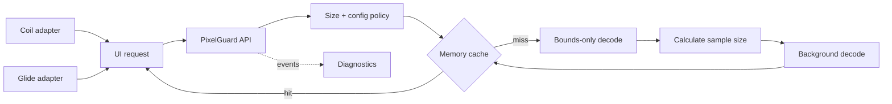

# PixelGuard

**Memory-safe image loading guardrails for Android.**

[](https://github.com/abstractednick/PixelGuard/actions/workflows/ci.yml)
[](https://developer.android.com/about/versions/android-5.0)
[](https://kotlinlang.org/)
[](LICENSE)

PixelGuard is an opinionated Android toolkit for predictable bitmap memory use. It prevents
accidental full-resolution decodes, sizes its cache against the device heap, exposes runtime
telemetry, and adds bounded request APIs to Coil and Glide.

> Built as a focused reference implementation of Android's **reduce, reuse, recycle** guidance:
> reduce decoded pixels, reuse cached results, and avoid retaining bitmap ownership in diagnostics.

## Why PixelGuard?

A 4,000 × 3,000 `ARGB_8888` photo can require roughly **45.8 MiB** before UI and app overhead.
Loading it directly into a 400 × 300 avatar wastes over 99% of those pixels. PixelGuard makes the
target dimensions mandatory and performs a bounds-only pass before allocating the final bitmap.

| Risk | PixelGuard guardrail |
| --- | --- |
| Full-resolution decode into a small view | Power-of-two downsampling before allocation |
| Unbounded in-memory retention | Byte-sized `LruCache` capped to a heap fraction |
| Accidental quality/memory mismatch | Explicit opaque `RGB_565` or default `ARGB_8888` policy |
| Repeat and oversized loads hidden in production code | Metadata-only diagnostics listener |
| Coil/Glide requests without dimensions | Adapters require maximum width and height |
| Main-thread manual decode | Suspending API dispatched to `Dispatchers.IO` |

## Architecture



### Modules

| Module | Responsibility |
| --- | --- |
| `pixelguard-core` | Source abstractions, safe decoder, immutable policy, LRU cache, events |
| `pixelguard-diagnostics` | Cache telemetry, duplicate-load signals, oversized-source warnings |
| `pixelguard-coil` | Bounded Coil 2 requests with explicit bitmap config policy |
| `pixelguard-glide` | Bounded Glide requests with decode format and disk-cache control |
| `sample` | Runnable app showing initialization, a guarded remote load, and live metrics |

## Quick start

PixelGuard is currently source-distributed. Clone the repository and include the modules in your
Android build, or publish them to your local Maven repository:

```bash
./gradlew publishToMavenLocal
```

```kotlin
dependencies {
    implementation("io.github.abstractednick:pixelguard-core:1.0.0")
    debugImplementation("io.github.abstractednick:pixelguard-diagnostics:1.0.0")

    // Choose one integration:
    implementation("io.github.abstractednick:pixelguard-coil:1.0.0")
    implementation("io.github.abstractednick:pixelguard-glide:1.0.0")
}
```

### Initialize once

```kotlin
class App : Application() {
    override fun onCreate() {
        super.onCreate()

        PixelGuard.initialize(
            context = this,
            config = PixelGuardConfig(
                maxMemoryFraction = 0.20f,
                enableOversizeWarnings = true,
            ),
            eventListener = PixelGuardDiagnostics(),
        )
    }
}
```

### Decode local media safely

```kotlin
lifecycleScope.launch {
    val bitmap = PixelGuard.decode(
        source = ImageSource.FileSource(photoPath),
        targetWidth = imageView.width,
        targetHeight = imageView.height,
        opaque = true,
    )
    imageView.setImageBitmap(bitmap)
}
```

### Bound Coil or Glide requests

```kotlin
PixelGuardCoil.load(
    imageLoader = imageLoader,
    data = imageUrl,
    targetView = imageView,
    options = PixelGuardCoilOptions(maxWidth = 800, maxHeight = 800),
)

PixelGuardGlide.load(
    model = imageUrl,
    targetView = imageView,
    options = PixelGuardGlideOptions(maxWidth = 800, maxHeight = 800),
)
```

## Design decisions that matter in review

These choices are intentional and documented so recruiters and reviewers can evaluate engineering
judgment, not just API surface.

- **No `InputStream` source.** Decoding reads once for dimensions and once for pixels. `ImageSource`
  therefore guarantees repeatable reads and offers `Bytes` for one-shot data.
- **No bitmap references in diagnostics.** Telemetry stores keys, counters, dimensions, and bytes
  only. Observability must not create the leak it is trying to find.
- **No automatic `Bitmap.recycle()`.** Recycling a bitmap still displayed by a view causes rendering
  failures. Eviction releases the cache reference and lets Android manage the allocation safely.
- **Immutable runtime policy.** Initialization installs a complete configuration atomically, avoiding
  races caused by mutable global flags.
- **Adapters, not another image pipeline.** Coil and Glide remain responsible for networking and disk
  caching; PixelGuard adds an explicit, reviewable request boundary.
- **Ratio-based downsampling.** Sample size is derived from the larger of width/height ratios so the
  decoded result stays within the requested UI budget.

## Project layout

```text
PixelGuard/
  pixelguard-core/
  pixelguard-diagnostics/
  pixelguard-coil/
  pixelguard-glide/
  sample/
  docs/
    overview.md
    architecture.md
    migration-guide.md
    testing.md
  .github/workflows/ci.yml
```

## Verification

```bash
./gradlew testDebugUnitTest lintDebug assembleDebug
```

CI runs unit tests, Android lint, a debug build, and validates the Gradle wrapper on every push and
pull request. See [testing and performance guidance](docs/testing.md) for profiler scenarios and
memory-budget validation.

## Documentation

- [Overview](docs/overview.md)
- [Architecture and data flow](docs/architecture.md)
- [Adoption and migration guide](docs/migration-guide.md)
- [Testing and profiling strategy](docs/testing.md)
- [Security policy](SECURITY.md)
- [Contributing](CONTRIBUTING.md)
- [Changelog](CHANGELOG.md)

## Roadmap

- Optional bitmap pool for compatible mutable decodes
- Disk cache for preprocessed local media
- Video thumbnail guardrails and animated-image budgets
- Compose integration and an interactive debug HUD
- Maven Central publication and generated API reference

## License

PixelGuard is released under the [MIT License](LICENSE).
